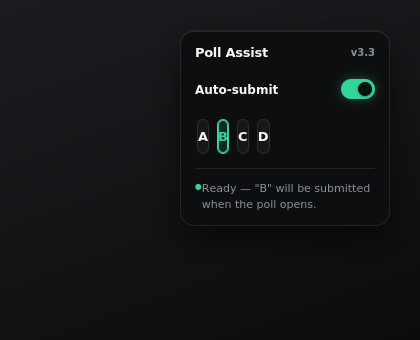

# Poll Assist for PW Live

A small Chrome extension for PW.live **live classes**. Pick the answer you've already worked out (A/B/C/D), and the moment a poll appears on screen, it's selected — and submitted, if you want — automatically.

[](./LICENSE)

> **Unofficial project.** Not affiliated with, endorsed by, or connected to Physics Wallah or PW.live in any way. It may break whenever PW.live changes their site.

<p align="center">
  
</p>

## Table of contents

- [Installation](#installation)
- [How to use](#how-to-use)
- [Settings](#settings)
- [Privacy](#privacy)
- [Responsible use](#responsible-use)
- [Troubleshooting](#troubleshooting)
- [Contributing](#contributing)
- [Changelog](#changelog)
- [License](#license)

## Installation

Not published on the Chrome Web Store — you load it directly from this repo.

1. **Download or clone this repository**
   ```bash
   git clone https://github.com/dottedcondom/pw-poll-extension.git
   ```
2. Open Chrome and go to `chrome://extensions`
3. Toggle on **Developer mode** (top right)
4. Click **Load unpacked** and select the folder you downloaded
5. Open a **live** class on `pw.live` — a small control appears next to the poll icon within a few seconds

## How to use

1. While solving the problem, click the checkmark icon to open the panel, then click **A**, **B**, **C**, or **D** to mark your intended answer — it turns green once armed. Click the same option again to deselect it.
2. Keep **Auto-submit** checked to have it click Submit automatically. This preference is remembered across page reloads.
3. When the poll opens, your choice is selected (and submitted, if auto-submit is on) immediately.
4. A status message in the panel tells you what happened — e.g. "Selected 'B'", "Submitted 'B' in 210ms", or a warning if something didn't match.

**Note:** this only works on **live** classes, not recorded ones.

## Settings

Click the extension's icon in Chrome's toolbar to open the settings panel:

| Setting | What it does |
|---|---|
| **Auto-submit** | Clicks Submit automatically once your pre-chosen answer is selected. Synced with the in-page toggle. |
| **Delay before submitting** | A slider (0–5s) plus a precise field for exact control over when it clicks Submit. |
| **Hide with video controls** | Fades the button out after a few seconds of no mouse movement, and back in when you move it — like the video player's own controls. |
| **Auto-open poll panel** | Opens the poll panel automatically as soon as a poll becomes available. |
| **Debug logging** | Verbose console output (F12), for troubleshooting. |

Changes apply immediately — no page reload needed.

## Privacy

- **No network calls.** The extension never sends anything to any server — no analytics, no telemetry.
- **Settings stay on your device.** Never synced to any account or cloud.
- **Minimal permissions.** The extension only asks for local storage access — nothing else.
- **No chat or other page data is read or stored** — the extension only pays attention to the specific poll events it needs to do its job.
- **Debug logging is off by default**, and even when turned on, only prints to your own browser console.

## Responsible use

This is meant for one specific case: you've already worked out the answer yourself, and you just want it submitted reliably and without delay once the poll opens — not to skip the problem entirely. Polls exist to check that you're actually following along; using this to answer things you haven't worked through defeats that purpose and isn't what this tool is for.

## Troubleshooting

- **Button not appearing** — this only works on live classes (identified by the presence of the poll icon). Recorded classes aren't supported.
- **Button not appearing/reappearing** — open the popup and turn **off** "Hide with video controls" to keep it always visible.
- **No errors, but nothing happens** — open DevTools Console (F12); warnings prefixed `[PW Poll Assist]` usually mean PW.live's markup for that poll looks different from what the extension expects.
- **Want more detail** — turn on "Debug logging" in the popup for a step-by-step console trace.
- **Still stuck** — open an issue with a screenshot or console output, and it'll get looked at.

## Contributing

Issues and pull requests are welcome, especially if PW.live changes something and the extension stops working. A good bug report includes a screenshot or console output — see [Troubleshooting](#troubleshooting).

## Changelog

<details>
<summary>Click to expand version history</summary>

**v3.3** — Redesigned the delay slider with a smoother, more precise look and feel.

**v3.2** — Visual polish pass on the popup and in-page panel: smoother animations, better contrast, more consistent styling throughout.

**v3.1** — Reworked the popup's look and removed a status banner that didn't add much.

**v3.0** — Internal cleanup; version number is now read automatically instead of needing to be updated by hand in multiple places.

**v2.9** — Fixed a bug where a new poll could occasionally be missed right after the previous one closed, and a related bug where an already-answered poll could be mistaken for a new one.

**v2.8** — Fixed a flicker where the button would briefly disappear and reappear during normal page updates, and a bug where a failed submission could leave a stale answer armed for the next poll.

**v2.7** — Removed support for recorded classes rather than leaving it half-working — there's no reliable way to place the button reliably there.

**v2.5–v2.6** — Faster, more responsive detection; safeguards against duplicate actions.

**v2.1–v2.4** — Switched to detecting polls via the site's own real-time signal instead of guessing, for more reliable and immediate detection.

**v2.0** — Visual redesign: proper icon, polished popup and in-page panel, color-coded status.

**v1.1** — Added the settings popup (auto-submit, delay, debug logging).

**v1.0** — Initial release: pre-select an answer, auto-detect the poll, auto-submit.

</details>

## License

MIT — see [LICENSE](./LICENSE).
